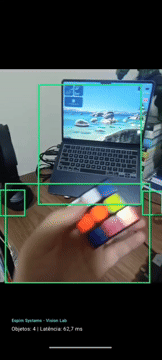

# Object Detection Lab

<p align="center">
  
</p>

<p align="center">
  <strong>Real-time on-device object detection for Android</strong><br/>
  Built with CameraX, Jetpack Compose, TensorFlow Lite, NDK (C++), Coroutines/Flow, Hilt, and a modular Clean Architecture + MVI setup.
</p>

<p align="center">
  
  
  
  
  
  
</p>

## Overview

Object Detection Lab is a portfolio-grade Android project focused on one core problem: **running a real-time vision pipeline on-device with low latency and clear architectural boundaries**.

Instead of treating computer vision as a black-box SDK integration, this repository makes the pipeline explicit:

- **CameraX** captures frames in `YUV_420_888`
- **NDK / C++** handles low-level image pre-processing
- **TensorFlow Lite** runs inference locally on-device
- **Compose** renders the live overlay and runtime HUD
- **MVI + Clean Architecture** keeps feature logic separate from infrastructure

The goal is to communicate engineering maturity, not just “it works”.

---

## Engineering Highlights

### Low-latency
The hot path is intentionally split so expensive image work can move closer to native memory. The project uses an **NDK (C++) layer via JNI** for image pre-processing, reducing unnecessary managed-heap work during continuous camera ingestion and creating a stronger base for handling `YUV_420_888` frames with lower latency.

### Modularization
The codebase is divided into **`:core`** and **`:feature`** modules so responsibilities stay explicit:

- `:core` contains reusable infrastructure and platform capabilities
- `:feature` contains flow orchestration, UI state, and screen-level behavior

That split makes the project easier to reason about, benchmark, evolve, and discuss in a senior-level interview.

### Offline-first AI
Inference is designed to run **fully on-device** with TensorFlow Lite. That brings practical product benefits:

- better privacy
- lower serving cost
- lower end-to-end latency
- resilience when the network is unavailable

For mobile AI products, this is often the difference between a demo and a usable feature.

---

## Demo

The current prototype demonstrates:

- real-time camera preview
- live bounding box overlay in Compose
- on-device object detection
- runtime HUD with object count and latency
- a pipeline designed for GPU acceleration with CPU fallback

---

## Why this project exists

Many mobile vision samples stop at the integration layer. This project is intentionally different.

It is designed to study and demonstrate how to build a real-time Android vision system with decisions expected from a strong senior/principal engineer:

- explicit frame ownership
- clear module boundaries
- minimal main-thread work
- native interop through JNI
- replaceable ML/runtime layers
- UI overlay rendering separated from image processing
- room for benchmarking and future optimization

---

## Architecture at a glance

```text
object-detection-lab/
├── app/                        # Android application / composition root
├── core/
│   ├── common/                 # Shared contracts and domain models
│   ├── dispatchers/            # Coroutine dispatchers / threading abstractions
│   ├── designsystem/           # Theme, tokens, visual primitives
│   ├── camera/                 # CameraX integration and frame ingestion
│   ├── cpp/                    # JNI bridge + native image processing (C++)
│   └── ml/                     # TFLite engine and ML-specific wiring
├── feature/
│   └── detection/              # Detection feature: state, use case, ViewModel, UI
├── benchmark/
│   └── macrobenchmark/         # Performance benchmarking module
└── gradle/                     # Version catalog
```

### Architectural roles

#### `:app`
The composition root. It wires modules together and owns app-level setup.

#### `:core:*`
Reusable infrastructure and technical capabilities such as:

- frame capture
- native processing
- ML inference
- dispatchers
- design system
- UI building blocks

#### `:feature:detection`
Owns the user-facing detection flow:

- state
- intent handling
- feature orchestration
- detection screen UI

---

## End-to-end pipeline

```text
CameraX (YUV_420_888)
        ↓
FrameSource / Flow pipeline
        ↓
NDK / JNI pre-processing
        ↓
TensorFlow Lite inference
        ↓
Detection state update
        ↓
Compose overlay + runtime HUD
```

This separation is deliberate. It makes the system easier to inspect, optimize, test, and discuss.

---

## Performance-oriented decisions

This repository is built around practical real-time constraints:

- keep the **main thread** free of heavy work
- treat image pre-processing as a first-class performance problem
- avoid hiding expensive work inside UI code
- isolate ML runtime concerns behind contracts
- prefer explicit pipeline stages over accidental coupling
- leave room for measurement before optimization

### Why the NDK layer matters

For continuous camera analysis, image conversion is often the real bottleneck. By isolating low-level frame work into `:core:cpp`, the project makes that constraint visible and creates a better path toward:

- tighter memory control
- lower allocation pressure
- better latency characteristics
- clearer ownership of native work

---

## Tech stack

- **Kotlin**
- **Jetpack Compose**
- **CameraX**
- **Coroutines & Flow**
- **Hilt**
- **NDK / C++ / JNI**
- **CMake**
- **TensorFlow Lite**
- **GPU delegate / CPU fallback**
- **Clean Architecture + MVI**
- **Gradle multi-module setup**

---

## Getting started

### Prerequisites

- Android Studio with NDK support installed
- JDK 17
- Android SDK 35+
- NDK 26.1.10909125
- CMake 3.22.1
- A physical Android device for camera/performance testing

### Model asset

The TensorFlow Lite model should be available at:

```text
core/ml/src/main/assets/model.tflite
```

### Build

```bash
./gradlew clean
./gradlew :app:assembleDebug
```

Then run the app on a device and grant camera permission.

---

## What makes this portfolio-worthy

This repository is not just about object detection. It is meant to communicate capability in areas that matter for modern Android roles:

- performance-aware engineering
- native interop
- modular system design
- on-device AI integration
- modern Android UI architecture
- thinking in pipelines instead of isolated screens

For a hiring manager or senior engineer reviewing the project, the most important thing to inspect is not only the output on screen, but how the system is structured to support correctness, performance, and future iteration.

---

## Suggested roadmap

Natural next steps for evolving this lab include:

- stronger frame-to-preview coordinate mapping
- buffer reuse / pooling on the hot path
- stage-by-stage timing instrumentation
- model label mapping and richer overlay data
- multiple model support and runtime switching
- smoother overlay animation between inference updates

---

## Reviewer guide

If you are reviewing this repository from an engineering perspective, the best places to inspect are:

- `:core:camera` → frame ingestion and analysis boundaries
- `:core:cpp` → JNI and native image processing responsibilities
- `:core:ml` → interpreter/delegate setup and model boundary
- `:feature:detection` → state, orchestration, and Compose overlay
- `:benchmark:macrobenchmark` → performance validation strategy

---

## License

This project is licensed under the Apache License 2.0 - see the [LICENSE](./LICENSE) file for details.

---

## Author note

Object Detection Lab is built as an engineering-first portfolio project.

The intent is to make the important decisions visible: where the latency risks are, where module boundaries matter, where native code helps, and how on-device AI can be integrated into a modern Android architecture without collapsing everything into a single demo module.
